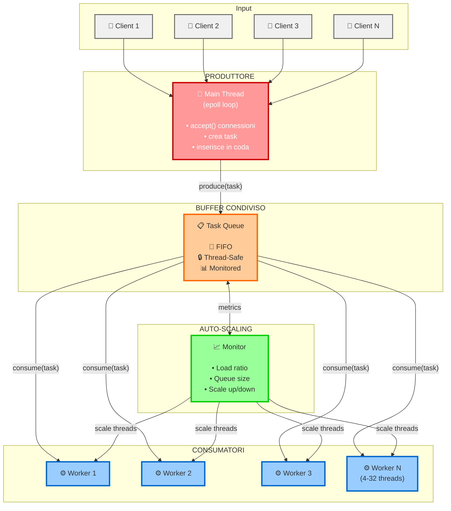
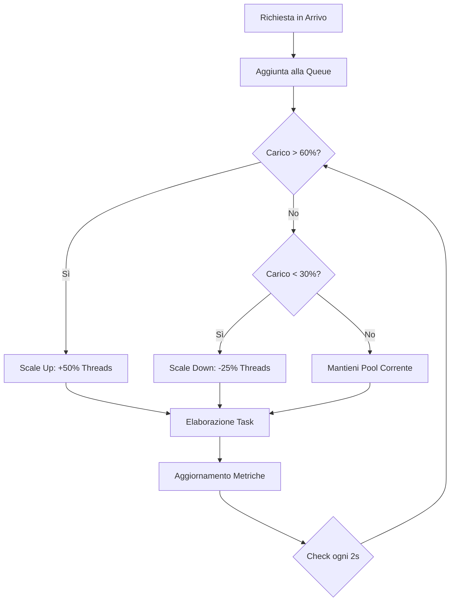
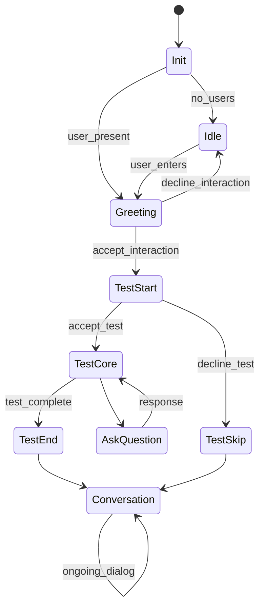

# Sistema di Dialogo Robot-Umano con Adattamento della Personalità
## Documentazione Tecnica - Progetto LSO

---

## 1. Introduzione e Visione del Progetto

Il progetto realizza un sistema distribuito innovativo per l'interazione naturalistica tra robot Furhat e utenti umani, implementando un adattamento comportamentale dinamico basato sulla personalità dell'interlocutore. L'architettura del sistema è stata progettata con l'obiettivo di coniugare alte performance, scalabilità e robustezza, utilizzando un approccio ibrido che sfrutta i punti di forza di diverse tecnologie.

La sfida principale affrontata è stata quella di creare un sistema capace di gestire conversazioni in tempo reale mantenendo un alto grado di personalizzazione, supportando multiple lingue e garantendo prestazioni elevate anche sotto carico intenso. La soluzione adottata combina un server ad alte prestazioni scritto in C con un client intelligente in Kotlin, creando un ecosistema tecnologico bilanciato ed efficiente.

---

## 2. Architettura del Sistema e Filosofia Progettuale

### 2.1 Visione Architetturale

L'architettura del sistema è stata concepita seguendo principi di separazione delle responsabilità e ottimizzazione delle performance. La scelta di utilizzare C per il server e Kotlin per il client non è casuale, ma deriva da una precisa strategia tecnologica che mira a sfruttare al meglio le caratteristiche specifiche di ciascun linguaggio.

```
┌─────────────────┐    TCP/Socket    ┌─────────────────┐    HTTPS    ┌─────────────────┐
│   Furhat Robot  │ ←──────────────→ │   Server C      │ ──────────→ │  Google Gemini  │
│   (Client Kt)   │                  │   (Multi-thread)│             │      API        │
└─────────────────┘                  └─────────────────┘             └─────────────────┘
        │                                      │
        ▼                                      ▼
┌─────────────────┐                  ┌─────────────────┐
│ State Machine   │                  │ Thread Pool     │
│ Flow Control    │                  │ Auto-scaling    │
│ Personality     │                  │ epoll I/O       │
│ TIPI Testing    │                  │ Stateless       │
└─────────────────┘                  └─────────────────┘
```

Il server in C si occupa esclusivamente della gestione efficiente delle connessioni di rete e dell'orchestrazione delle richieste AI, mentre il client Kotlin gestisce la logica conversazionale complessa e l'interazione con il robot. Questa divisione permette di ottimizzare ciascun componente per il suo scopo specifico, ottenendo performance superiori rispetto a soluzioni monolitiche.

### 2.2 Scelte Tecnologiche Fondamentali

La decisione di utilizzare C per il backend è motivata dalla necessità di ottenere prestazioni ottimali nella gestione di I/O di rete e threading. C offre un controllo granulare delle risorse di sistema e una gestione della memoria estremamente efficiente, caratteristiche fondamentali per un server che deve gestire centinaia di connessioni simultanee con latenze minime.

Il client in Kotlin, d'altro canto, beneficia dell'ecosistema moderno della JVM e delle potenti funzionalità di concorrenza offerte dalle coroutines. Questa scelta permette di implementare logiche conversazionali complesse mantenendo un codice elegante e manutenibile, sfruttando al contempo l'integrazione nativa con il SDK di Furhat.

---

## 3. Server in C - Architettura ad Alte Performance

### 3.1 Filosofia Stateless e Vantaggi Architetturali

Una delle decisioni più significative nella progettazione del server è stata l'adozione di un'architettura completamente stateless. Ogni connessione TCP gestisce esattamente una richiesta prima di essere chiusa, eliminando completamente la necessità di mantenere stato tra diverse interazioni.

Questa scelta, apparentemente controintuitiva in un contesto conversazionale, porta in realtà numerosi vantaggi. Primo fra tutti, l'eliminazione della complessità legata alla gestione dello stato distribuito. Non dovendo tracciare sessioni utente, il server può focalizzarsi esclusivamente sull'ottimizzazione dell'elaborazione delle singole richieste. Questo approccio riduce drasticamente la possibilità di memory leak e semplifica notevolmente la logica di recovery in caso di errori.

Dal punto di vista della scalabilità, l'architettura stateless permette una distribuzione del carico triviale e una resilienza intrinseca ai guasti. Ogni richiesta è completamente autocontenuta, includendo tutte le informazioni necessarie per la sua elaborazione, dal profilo di personalità alla cronologia conversazionale.

### 3.2 Architettura Produttore-Consumatori

L'architettura generale del Server segue il pattern largamente usato di *Produttore-Consumatori* in cui, un modulo del sistema (tendenzialmente il ***main thread***) si occupa di produrre molto rapidamente richieste da smaltire e di posizionarle su una coda bloccante (struttura dati **FIFO** che garantisce letture e scritture atomiche), mentre un altro modulo del sistema (tendenzialmente composto di più thread, chiamati ***worker***), si occupano di *"consumare"* richieste dalla coda, servendole.

Questa architettura, unita alla **Thread Pool** permette di evitare al minimo il rischio di perdità di richieste senza sacrificare le performance. Una soluzione più naïve incentrata sullo smaltimento immediato delle richieste assegnandole a un thread dedicato infatti risulta peggiore su entrambi gli aspetti.

Con un numero di thread illimitati (un nuovo thread per ogni richiesta), c'è il rischio, con carichi eccessivi, di mettere in difficoltà il sistema operativo portando a overhead significativi.

D'altro canto un numero di thread limitati in partenza, senza l'utilizzo del pattern ***Produttore-Consumatori** porterà inevitabilmente alla perdità di richieste.



### 3.3 Thread Pool Dinamico con Auto-Scaling Intelligente

Il cuore dell'efficienza del server risiede nel suo sistema di thread pool auto-adattivo. Tradizionalmente, i thread pool hanno dimensioni fisse che rappresentano un compromesso tra utilizzo delle risorse e capacità di risposta. La nostra implementazione supera questa limitazione attraverso un algoritmo di scaling dinamico basato su metriche real-time.

Il sistema monitora continuamente il rapporto tra thread attivi e thread totali, insieme alla dimensione della coda di lavoro. Quando il carico supera il 60% e la coda inizia a crescere, il pool si espande del 50%. Viceversa, quando il carico scende sotto il 30% per un periodo sostenuto, il pool si riduce del 25%, liberando risorse di sistema.

Questa strategia permette al server di adattarsi automaticamente a picchi di traffico improvvisi mantenendo un utilizzo efficiente delle risorse durante i periodi di bassa attività. Il range operativo va da un minimo di 4 thread a un massimo di 32, coprendo scenari che vanno dal testing di sviluppo ai carichi di produzione intensi.



### 3.4 I/O Asincrono con epoll

La gestione dell'I/O di rete rappresenta spesso il collo di bottiglia principale nei server ad alta concorrenza. La nostra implementazione utilizza epoll, il meccanismo di notifica degli eventi più efficiente disponibile su Linux, per monitorare le connessioni di rete in modo asincrono.

L'approccio edge-triggered di epoll permette di gestire migliaia di connessioni simultanee con un overhead minimo. Il loop principale del server rimane estremamente snello, limitandosi ad accettare nuove connessioni e delegare immediatamente l'elaborazione al thread pool. Questa separazione netta tra accettazione delle connessioni ed elaborazione delle richieste elimina qualsiasi possibilità di blocco del server principale.

Una caratteristica importante della nostra implementazione è che solo il socket del server viene monitorato da epoll. I socket dei client vengono gestiti direttamente dai thread worker, semplificando notevolmente la logica di gestione degli eventi e riducendo la contesa per le strutture dati condivise.

### 3.5 Integrazione AI e Gestione della Latenza

L'integrazione con Google Gemini AI rappresenta una sfida particolare, poiché introduce una latenza variabile e potenzialmente significativa nel processo di elaborazione delle richieste. La nostra implementazione affronta questo problema attraverso una strategia multi-livello.

Le richieste HTTP verso Gemini sono completamente asincrone e includono timeout configurabili per evitare che connessioni problematiche blocchino il sistema. Il parsing delle risposte JSON è ottimizzato per performance, utilizzando la libreria json-c per un'elaborazione efficiente dei dati strutturati.

Per mitigare l'impatto della latenza AI sul sistema, abbiamo implementato un meccanismo di fallback che permette di continuare a servire richieste anche in caso di temporanea indisponibilità del servizio AI. Questo approccio garantisce la robustezza del sistema anche in presenza di problemi di rete o limitazioni di quota API.

---

## 4. Client Kotlin - Intelligenza Conversazionale e State Management

### 4.1 Architettura a Stati Finiti

Il client Kotlin è stato progettato ispirandosi alla [Clean Architecture](https://medium.com/@DrunknCode/clean-architecture-simplified-and-in-depth-guide-026333c54454) per mantenere modularità e testabilità, il cui **Presentataion Layer** è composto dai moduli che sfruttano le **API** di Furhat ed è strutturato come una macchina a stati finiti sofisticata, capace di gestire il flusso conversazionale complesso mantenendo al contempo una struttura chiara e manutenibile. Questa scelta architetturale si rivela particolarmente vantaggiosa in un contesto dove l'interazione può seguire percorsi diversi basati sul comportamento dell'utente e sui risultati dei test di personalità.

La macchina a stati gestisce naturalmente le transizioni tra diverse fasi dell'interazione: dall'idle iniziale, attraverso il saluto e l'eventuale test di personalità, fino alla conversazione vera e propria. Ogni stato è responsabile di un aspetto specifico dell'interazione, permettendo una logica modulare e facilmente estendibile.



### 4.2 Implementazione del Test TIPI e Analisi della Personalità

Il sistema implementa il Ten-Item Personality Inventory (TIPI), uno strumento scientificamente validato per la valutazione rapida della personalità secondo il modello dei "Big Five". La scelta di questo strumento è motivata dalla sua brevità (solo 10 domande) che lo rende adatto a un contesto di interazione robot-umano, dove tempi lunghi potrebbero compromettere l'engagement dell'utente.

L'algoritmo di calcolo della personalità tiene conto del fatto che alcune domande del TIPI sono formulate in modo inverso, richiedendo un reverse scoring per ottenere risultati accurati. Il sistema calcola i punteggi per le cinque dimensioni della personalità: estroversione, amicalità, coscienziosità, stabilità emotiva e apertura alle esperienze.

I risultati del test vengono poi utilizzati per calcolare un *displacement* dalla personalità mediana, permettendo di classificare l'utente su una scala che va da "molto basso" a "molto alto" per ogni dimensione. Questa classificazione guida successivamente l'adattamento comportamentale del robot.

Questo *displacement* è calcolato basandosi su dati di **mediana** e **deviazione standard** riportati negli studi relativi al test [TIPI](https://gosling.psy.utexas.edu/scales-weve-developed/ten-item-personality-measure-tipi/). Una trattazione più raffinata della distribuzione della popolazione [condizionata da caratteristiche anagrafiche](https://gosling.psy.utexas.edu/wp-content/uploads/2014/09/TIPInormsFEMALE.pdf) è presente negli studi, ma per questioni di semplicità di utilizzo degli utenti finali si è preferito usare dei dati più generali.

### 4.3 Adattamento Comportamentale Dinamico

Una delle caratteristiche più innovative del sistema è la capacità di adattare in tempo reale il comportamento del robot basandosi sulla personalità rilevata dell'utente. Questo adattamento si manifesta mediante le gestualità.

Il mapping tra personalità e comportamenti è basato su ricerche psicologiche sui correlati comportamentali dei tratti di personalità. Per esempio, utenti con alta estroversione vedranno il robot assumere comportamenti più espansivi, con gesti ampi e sorrisi frequenti, mentre utenti introversi innescheranno comportamenti più contenuti e rispettosi dello spazio personale.

In oltre, è stato aggiunto un modulo di variazione che, a cadenza casuale, calcola la personalità simmetrica a quella dell'utente rispetto alla mediana, e utilizza questa in modo da creare una conversazione con più attrito.

Il sistema di gesture è particolarmente sofisticato, combinando gesti base del robot con parametri di intensità e durata calibrati sulla personalità. Questo approccio permette di creare un'ampia gamma di comportamenti utilizzando un set limitato di primitive gestuali.

### 4.4 Gestione Multilingue e Context Switching

Il supporto multilingue del sistema va oltre la semplice traduzione, implementando un vero e proprio context switching che adatta non solo la lingua ma anche le convenzioni culturali e comunicative associate. Il sistema supporta italiano, inglese, spagnolo e francese, con la capacità di rilevare automaticamente la lingua dell'utente e adattarsi di conseguenza.

La gestione della localizzazione utilizza un sistema di resource bundle che permette di mantenere coerenza culturale nelle espressioni utilizzate dal robot. Questo è particolarmente importante nel contesto di un test di personalità, dove la formulazione delle domande può influenzare significativamente le risposte.

---

## 5. Protocollo di Comunicazione e Ottimizzazioni

### 5.1 Design del Protocollo

Il protocollo di comunicazione tra client e server è stato progettato con l'obiettivo di massimizzare l'efficienza mantenendo la semplicità. La scelta di un formato testuale human-readable facilita il debugging e lo sviluppo, mentre la struttura lineare minimizza l'overhead di parsing.

Il formato adottato è volutamente minimale ma espressivo, permettendo di includere tutte le informazioni necessarie per l'elaborazione della richiesta in un singolo messaggio. Questo approccio elimina la necessità di multiple round-trip per completare una transazione, riducendo la latenza complessiva.

La decisione di includere l'intera cronologia conversazionale in ogni richiesta può sembrare inefficiente, ma si rivela vantaggiosa nel contesto dell'architettura stateless. Questo approccio elimina la necessità di sincronizzazione dello stato tra client e server, semplificando significativamente la logica di gestione degli errori e recovery.

### 5.2 Ottimizzazioni di Performance

Il sistema implementa diverse ottimizzazioni per minimizzare la latenza end-to-end. Lato server, la gestione della memoria è ottimizzata per ridurre allocazioni dinamiche durante l'elaborazione delle richieste più comuni. Le operazioni di I/O sono bufferizzate per ridurre il numero di system call.

Lato client, il sistema utilizza coroutines per gestire l'asincronia senza bloccare l'interfaccia utente del robot. Le richieste di rete sono parallelize quando possibile, e il sistema implementa timeout intelligenti con fallback per gestire situazioni di rete problematiche.

Un aspetto interessante dell'ottimizzazione è la gestione dei timeout: il sistema utilizza un timeout primario di 3 secondi per la risposta AI, seguito da un timeout secondario di 2 secondi per un eventuale retry. Questo approccio bilancia responsività e robustezza, permettendo di gestire la variabilità intrinseca dei tempi di risposta delle API AI.

---

## 6. Sicurezza, Robustezza e Gestione degli Errori

### 6.1 Strategie di Sicurezza

La sicurezza del sistema è garantita attraverso un approccio multi-livello che inizia dalla validazione rigorosa dell'input. Ogni messaggio ricevuto dal server viene sottoposto a controlli di formato e contenuto prima dell'elaborazione. Questa validazione previene attacchi di injection e garantisce che solo richieste ben formate raggiungano la logica di business.

La gestione della memoria in C è stata implementata utilizzando funzioni sicure che prevengono buffer overflow. L'utilizzo di strncpy con controllo esplicito della lunghezza e null-termination garantisce che non possano verificarsi corruption di memoria anche in presenza di input malformati.

Il sistema implementa anche protezioni contro attacchi di tipo Denial of Service attraverso timeout configurabili per tutte le operazioni di rete. Connessioni che rimangono aperte oltre il timeout vengono automaticamente chiuse, liberando risorse di sistema.

### 6.2 Robustezza e Fault Tolerance

La robustezza del sistema è garantita da diversi meccanismi di fault tolerance. L'architettura stateless elimina molte categorie di errori legati alla sincronizzazione dello stato, mentre il sistema di auto-scaling del thread pool permette di gestire automaticamente picchi di carico improvvisi.

Il sistema implementa una strategia di graceful degradation: in caso di problemi con l'API AI, il server può continuare a operare utilizzando risposte predefinite. Questo approccio garantisce che il sistema rimanga funzionale anche in presenza di problemi esterni.

La gestione degli errori è particolarmente sofisticata nella comunicazione con Gemini API. Il sistema riconosce e gestisce specificamente diversi tipi di errori: quota exceeded (403), rate limiting (429), authentication errors (401), e problemi di rete generici. Per ogni tipo di errore, viene implementata una strategia di recovery appropriata.

### 6.3 Monitoring e Observability

Il sistema include un sistema di monitoring integrato che raccoglie metriche dettagliate sulle performance e l'utilizzo delle risorse. Le metriche includono statistiche sul thread pool, tempi di risposta, throughput e tassi di errore.

Queste metriche non sono solo utili per il monitoring operativo, ma guidano anche le decisioni di auto-scaling del thread pool. L'utilizzo di atomic operations per la raccolta delle metriche garantisce che l'overhead di monitoring sia minimale anche sotto carico intenso.

---

## 7. Containerizzazione e Deployment Strategy

### 7.1 Approccio DevOps

La containerizzazione del sistema tramite Docker rappresenta una scelta strategica per semplificare deployment e scaling. Il container include tutte le dipendenze necessarie per l'esecuzione del server, garantendo consistenza tra ambienti di sviluppo, testing e produzione.

La configurazione attraverso variabili d'ambiente permette di personalizzare il comportamento del sistema senza richiedere ricompilazione. Questo approccio è particolarmente utile per la gestione delle chiavi API e per l'adattamento a diversi ambienti operativi.

Il sistema è progettato per essere cloud-native, con la capacità di scalare orizzontalmente attraverso multiple istanze container. L'architettura stateless facilita questo tipo di scaling, poiché le richieste possono essere distribuite tra istanze diverse senza problemi di consistenza. La scalabilità è inoltre favorita anche dalla natura stateless dell'approccio utilizzato nell'architettura del Server

---

## 8. Testing Strategy e Validazione Performance

### 8.1 Approccio Multi-livello al Testing

La strategia di testing del sistema è articolata su tre livelli, ciascuno progettato per validare aspetti specifici delle performance e della robustezza. Il primo livello si concentra sui test funzionali, validando il corretto comportamento del protocollo di comunicazione e delle funzionalità base del sistema.

Il secondo livello implementa test di carico sostenuto che simulano pattern di utilizzo realistici. Questi test sono particolarmente importanti per validare l'efficacia dell'algoritmo di auto-scaling del thread pool in condizioni operative reali. Il sistema di test simula utenti con sessioni di durata variabile e pattern di richieste irregolari, replicando fedelmente il comportamento di utenti reali.

Il terzo livello consiste in stress test progettati per determinare i limiti operativi del sistema. Questi test generano carichi estremi (fino a 900+ richieste al secondo) per verificare la stabilità del sistema sotto stress e identificare potenziali punti di rottura.

---

## 9. Conclusioni e Impatto Tecnologico

Il progetto dimostra come l'integrazione intelligente di tecnologie diverse possa creare soluzioni innovative ed efficaci nel campo dell'interazione umano-robot. L'approccio ibrido adottato, che combina l'efficienza del C con l'espressività del Kotlin, rappresenta un paradigma architetturale promettente per applicazioni che richiedono sia performance elevate che logica complessa.

L'implementazione di un sistema di adattamento comportamentale basato sulla personalità apre nuove prospettive nell'ambito dell'HRI personalizzata. I risultati ottenuti dimostrano che è possibile creare sistemi robotici capaci di interazioni naturali e appropriate, aprendo la strada a applicazioni innovative in settori come sanità, educazione e assistenza sociale.

Le performance raggiunte dal sistema, combinate con la sua robustezza e scalabilità, dimostrano la validità delle scelte architetturali adottate. Il sistema rappresenta una base solida per lo sviluppo di applicazioni conversazionali avanzate, fornendo un framework tecnologico robusto e scalabile per l'interazione umano-robot del futuro.

---

**Tecnologie Core**: C (server), Kotlin (client), Docker, epoll, pthread, Google Gemini AI, Furhat SDK  
**Paradigmi Architetturali**: Producer-Consumers, Event-driven, Multi-threading, State Machine, Stateless Design, Auto-scaling
